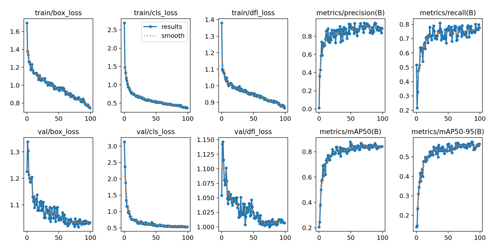
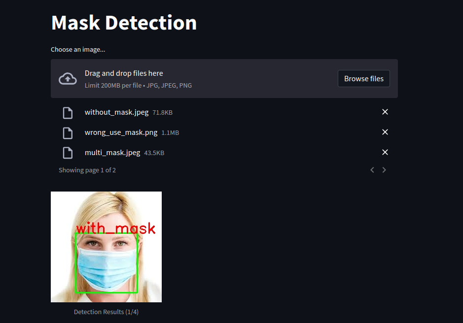
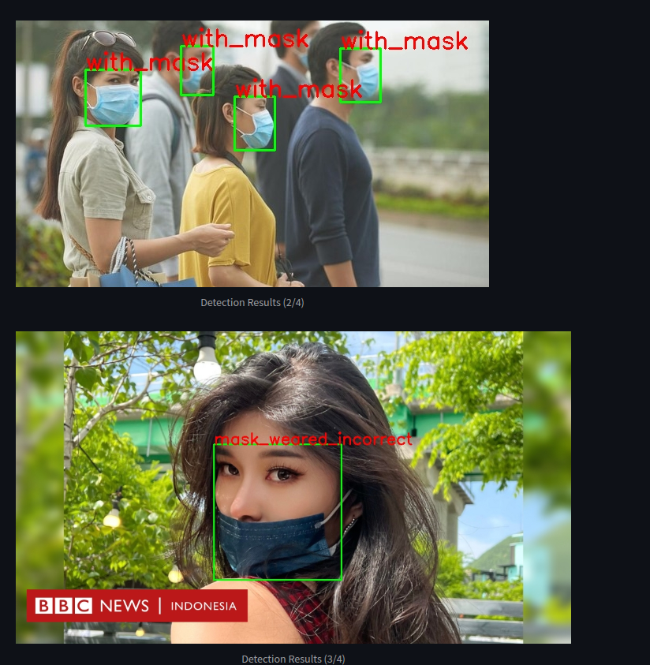
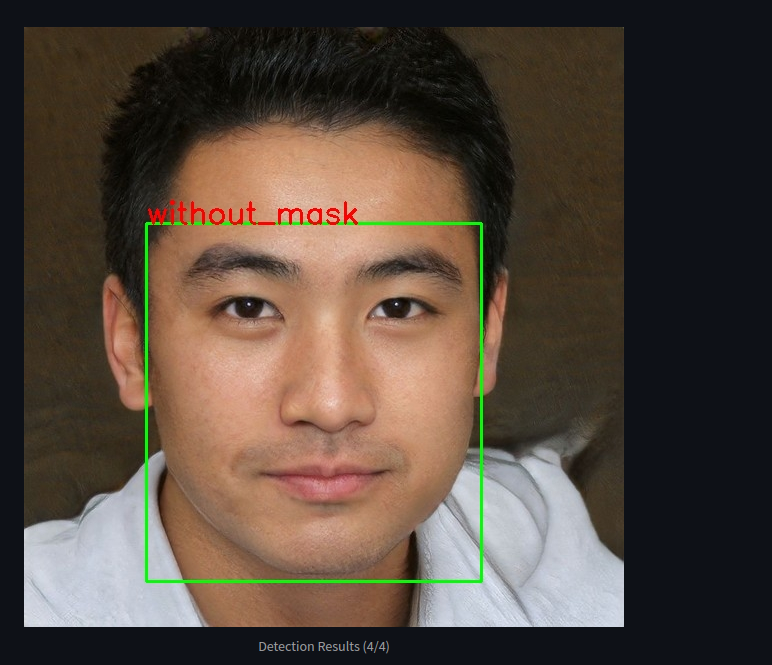
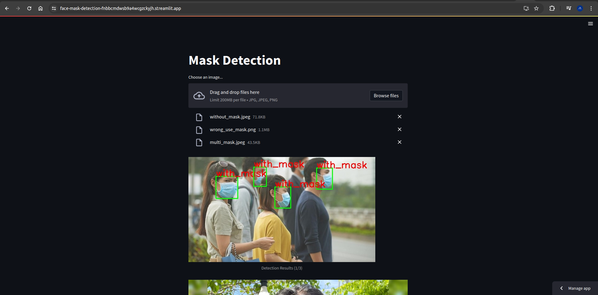

# Face-Mask-Detection-with-YOLOv8

## Description
The Face-Mask-Detection-with-YOLOv8 project is an implementation of a face mask detection system using the YOLOv8 object detection algorithm. It aims to detect whether a person is wearing a face mask, wear not correct, and not wear. The project utilizes deep learning techniques and computer vision to analyze images and classify individuals and multiple human as either wearing a face mask, wear not correct, or not wear. This system can be used in various applications, such as monitoring public spaces, ensuring compliance with safety regulations, and enhancing public health and safety.

## Dataset
The dataset used in this project is the Face Mask Detection dataset, which contains images of individuals wearing face masks, wearing face masks incorrectly, and not wearing face masks. The dataset is divided into three classes: with_mask, mask_weared_incorrect, and without_mask. The dataset is used to train the YOLOv8 object detection algorithm to detect and classify individuals based on their face mask status. The dataset is available on Kaggle and can be downloaded from the following link: [Face Mask Detection Dataset](https://www.kaggle.com/andrewmvd/face-mask-detection).

## Setup
Clone the repository:
```bash
    git clone https://github.com/farizalmustaqim/Face-Mask-Detection.git
    cd Face-Mask-Detection
```

Make virtual environment:
```bash
    python -m venv venv
```

Activate virtual environment:
```bash
    source venv/bin/activate
```

Install the required packages:
```bash
    pip install -r requirements.txt
```

## Training
The YOLOv8 object detection algorithm is trained on the Face Mask Detection dataset to detect and classify individuals based on their face mask status. The training process involves loading the dataset, preprocessing the images, training the model, and evaluating the model's performance. The trained model is then used to detect and classify individuals in images and videos based on their face mask status. The training process is implemented using the PyTorch deep learning library and the YOLOv8 object detection algorithm. For more information on the training process, please refer to the [notebook](/notebook/notebook-face-mask-detection-yolov8.ipynb) in the project repository.

## Evaluation
The trained YOLOv8 object detection algorithm is evaluated on the Face Mask Detection dataset to assess its performance in detecting and classifying individuals based on their face mask status. The evaluation process involves loading the dataset, preprocessing the images, evaluating the model's performance, and generating performance metrics. The evaluation results are used to assess the model's accuracy, precision, recall, and F1 score in detecting and classifying individuals based on their face mask status. For more information on the evaluation process, please refer to the [notebook](/notebook/notebook-face-mask-detection-yolov8.ipynb) in the project repository.

This result of the evaluation process is shown in the following image:


## Inferencing
1. I make api to make it easier to use the model. You can run the api by running the following command:
    ```bash
    python3 app.py
    ```
    Testing the api using script test on this repository. You can run the script by running the following command:
    ```bash
    python3 test-api.py
    ```
    Here the result of the test:
    ```json
    {
        'data': [['with_mask']], 
        'code': 200, 
        'message': 'Mask detection successful'
    }
    ```
2. I make a simple web application using streamlit to make it easier to use the model. You can run the web application by running the following command:
    ```bash
    streamlit run app.py
    ```
    Here the result of the web application:<br>
    <p align="center">
        
    </p>
    <p align="center">
        
    </p>
    <p align="center">
        
    </p>

## Preview of the project in streamlit
You can access the web application using the following link: [Face Mask Detection Web Application](https://face-mask-detection-fnbbcmdwsb9a4wcgzckyjh.streamlit.app/).<br>
    <p align="center">
        
    </p>